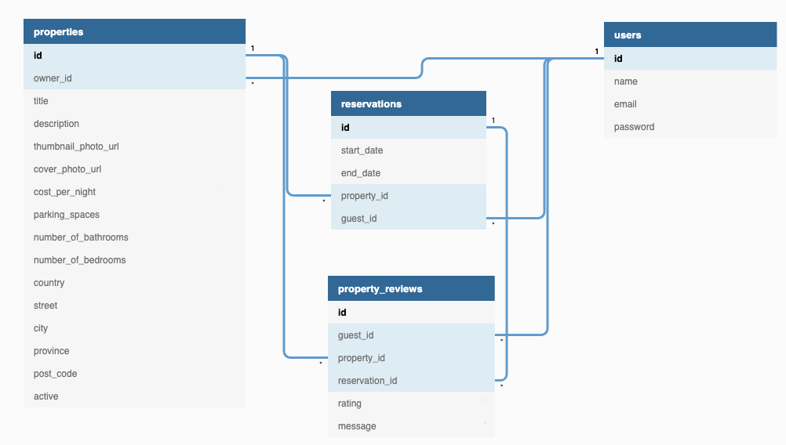
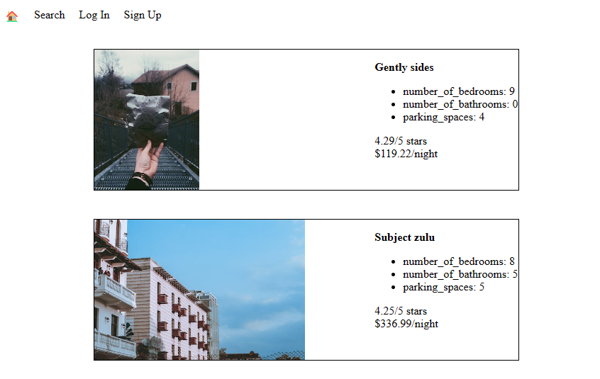
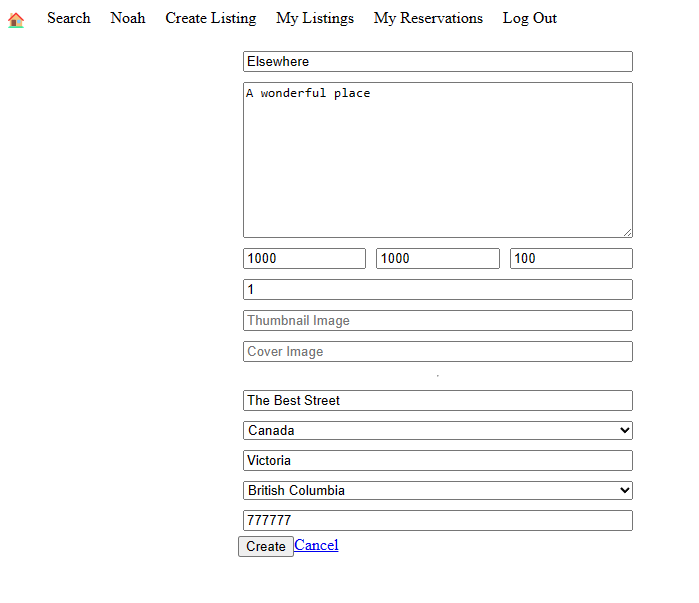
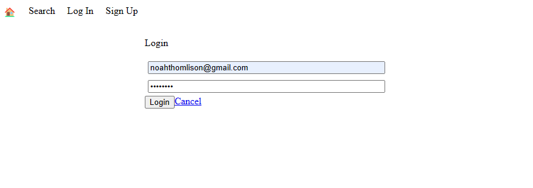

# LightBnB
Lighthouse BnB is a revolutionary new app that will allow homeowners to rent out their homes to people on vacation. Users can view property information, book reservations, view their reservations, and write reviews. It is constructed using Node.js and PostgreSQL.

## Features

**Browse Listings** - Users can browse through property listngs that have been submitted by other users.

**Login** - Users can manage their own account by signing up or logging in. Then they will be able to unlock additional features such as creating/managing their listings and searching for other listings.

**Search** - Users can search through property listings based on specific search criteria such as city, price range and rating.

**Create Listing** - Users can create their own property listing by submitting a form on the *Create Listing* page.

## Screenshots

### ERD Diagram



### Browse Home Page


### Create Listing


The form on the frontend will insert a new entry into to properties table

### Login Page


All example users in the database used have a password of `password` to make it easy to test.

## To Start:

1. Fork this repository and then clone it to your directory in terminal to create a local copy.

2. In terminal, go to psql and create a database called lightbnb: 
```
CREATE DATABASE lightbnb;
```

3. Connect to database:
```
\c lightbnb
```

4. Set up database tables:
```
\i migrations/01_schema.sql
```

5. Check the following tables have been created:
- properties
- property_reviews
- reservations
- users
```
\dt
```

6. Populate database data:
```
\i seeds/01_seeds.sql
\i seeds/02_seeds.sql
```

7. Setup psql connection for web app using  `psql -h localhost -p 5432 -U lightbnb`

8. Exit psql in terminal and go to project folder: `/lightbnb/LightBnB_WebApp` to install dependencies: 
```
npm install
```

9. Go to main project folder `/lightbnb` to start server:
```
npm run local
```

10. In web browser, go to http://localhost:3000/ to access 